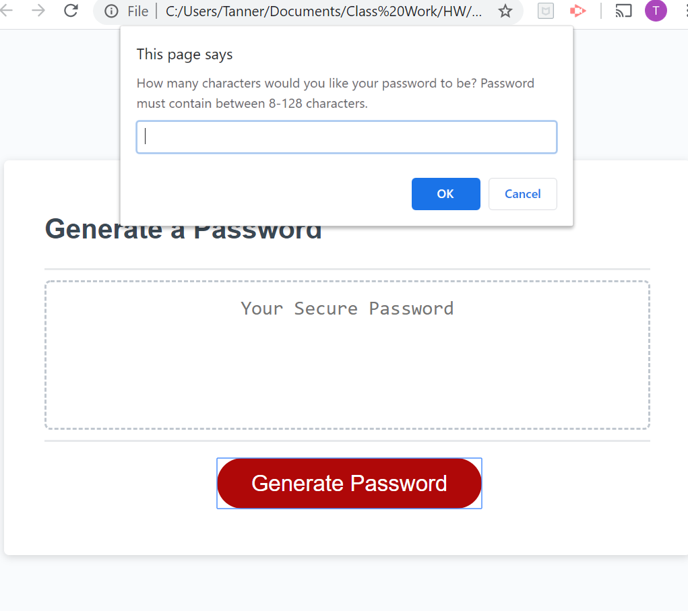
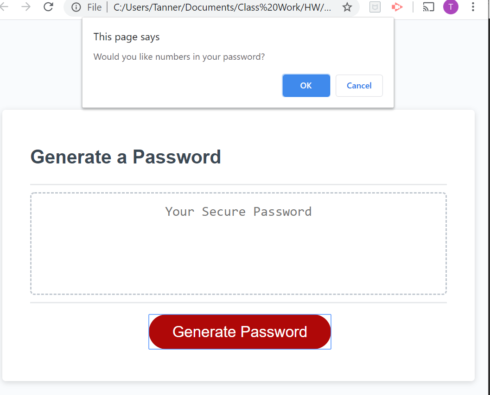
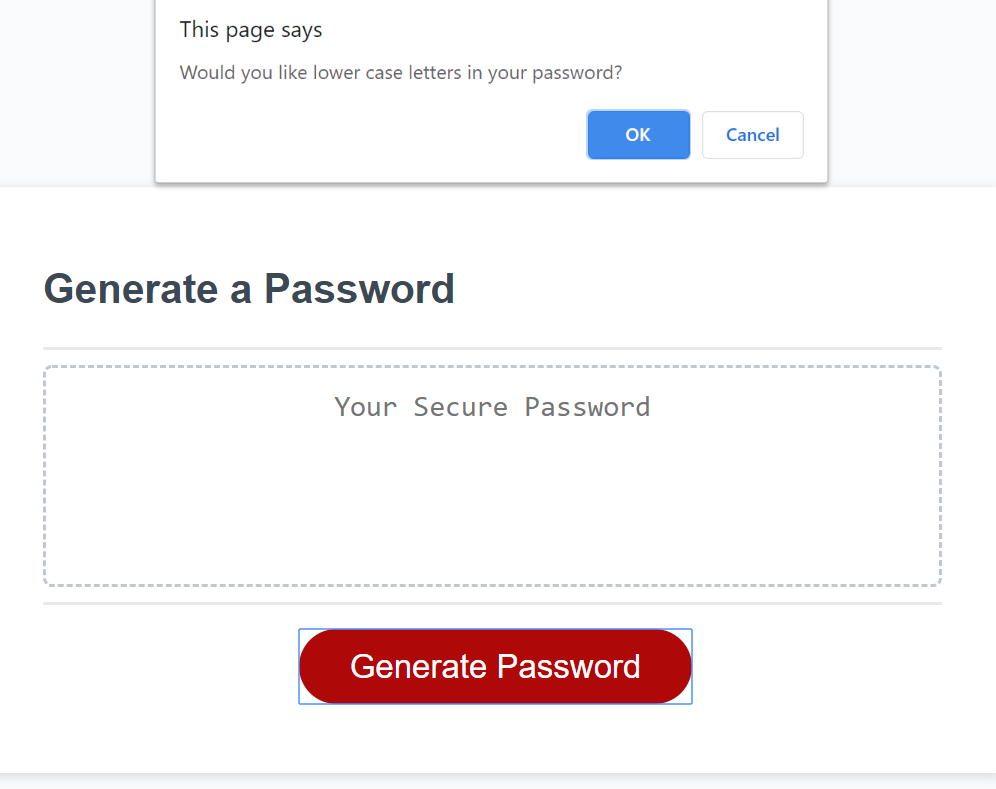
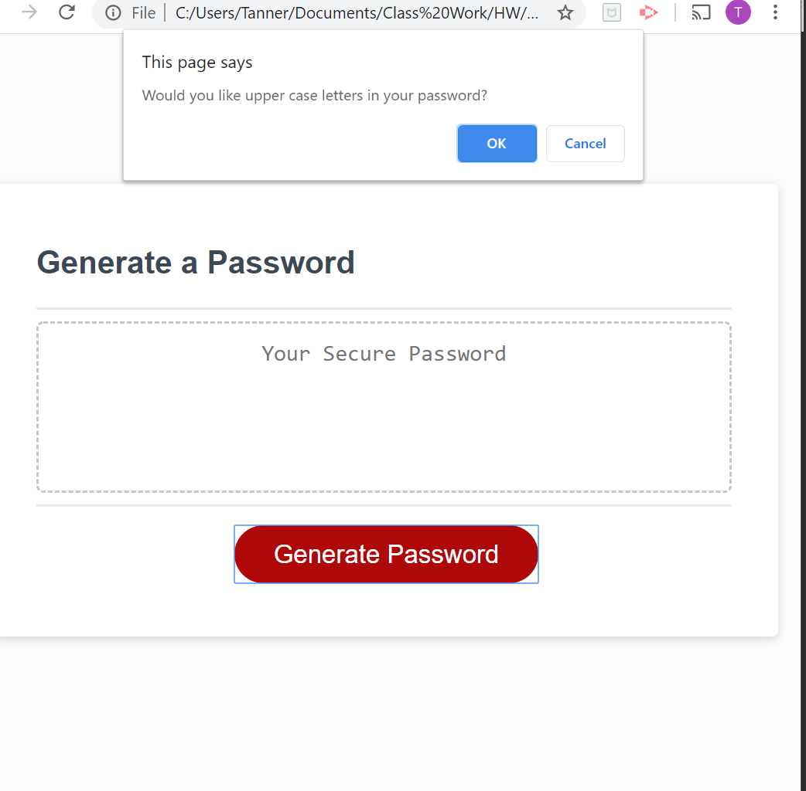
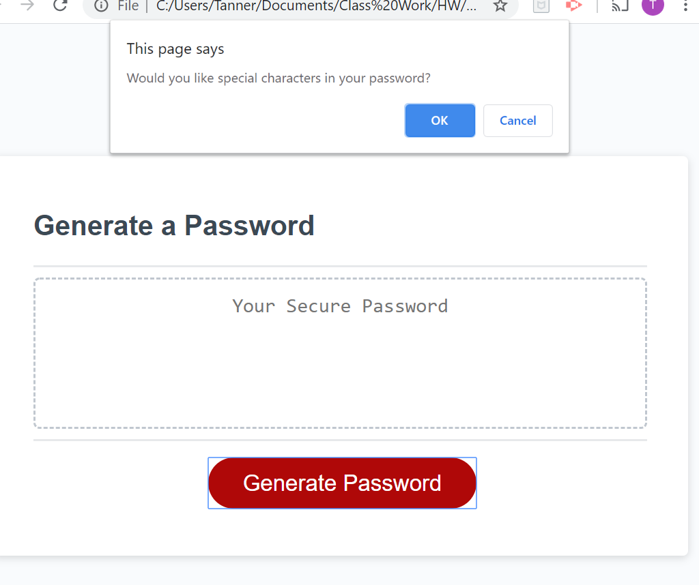
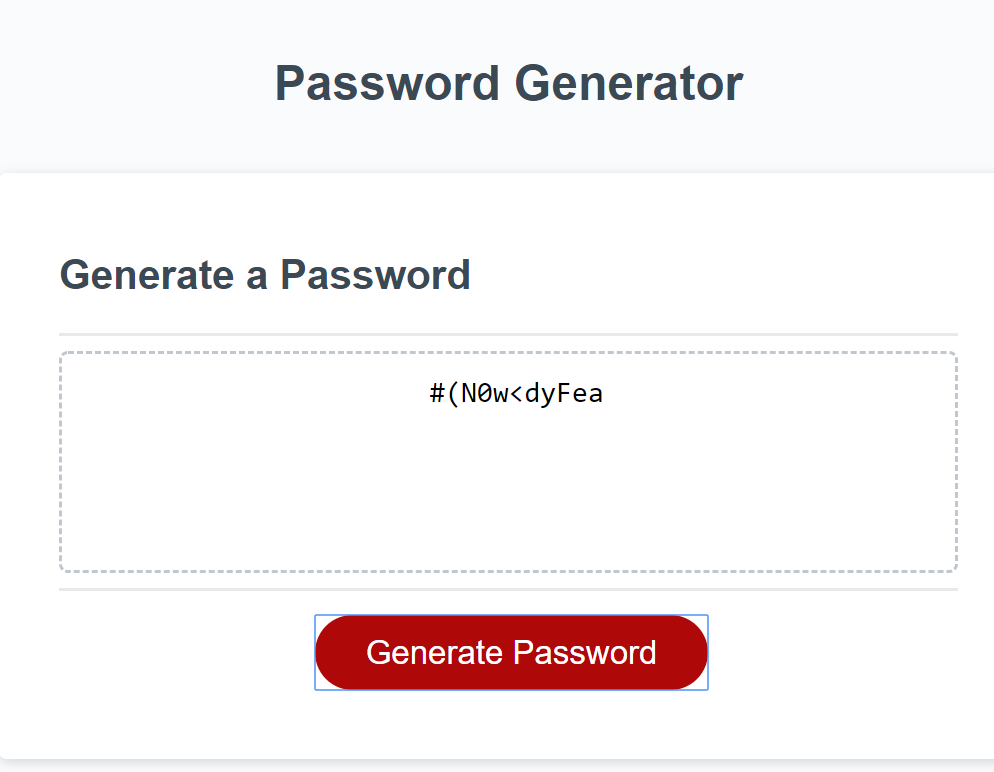

# Password-Generator

The goal of this homework was to be able to generate a random password that met a certain criteria.  The generated password helps create a strong password that provides greater security. The accepted criteria included:
```
GIVEN I need a new, secure password
WHEN I click the button to generate a password
THEN I am presented with a series of prompts for password criteria
WHEN prompted for password criteria
THEN I select which criteria to include in the password
WHEN prompted for the length of the password
THEN I choose a length of at least 8 characters and no more than 128 characters
WHEN prompted for character types to include in the password
THEN I choose lowercase, uppercase, numeric, and/or special characters
WHEN I answer each prompt
THEN my input should be validated and at least one character type should be selected
WHEN all prompts are answered
THEN a password is generated that matches the selected criteria
WHEN the password is generated
THEN the password is either displayed in an alert or written to the page
```
## How it Works
To do this, I created **if/else/else statements** that also included a **for loop**.  The different **confirms** and **prompts** include **how many characters the user wanted**, having **Numbers**, **upperCase**, **lowerCase**, and **specialCharacters**.  The user must select confirm for at **least one of these questions**.  Below are pictures of each event as the user uses the password generator.

Starting page when "Generate Password" is clicked:



After user inputs number of characters they want (between 8-128) they are asked four questions.  They can confirm or cancel for each question but they must confirm at least one:









Once they have confirmed/canceled all four questions, their password will be generated based on how they answered the questions. Again, they must confirm at least one of the questions.

The following picture is an example of the user wanting 10 characters and confirming all four questions:

